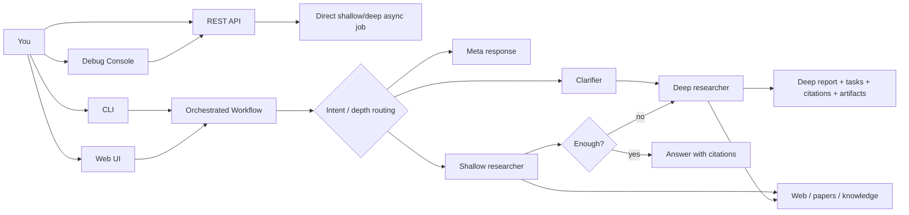
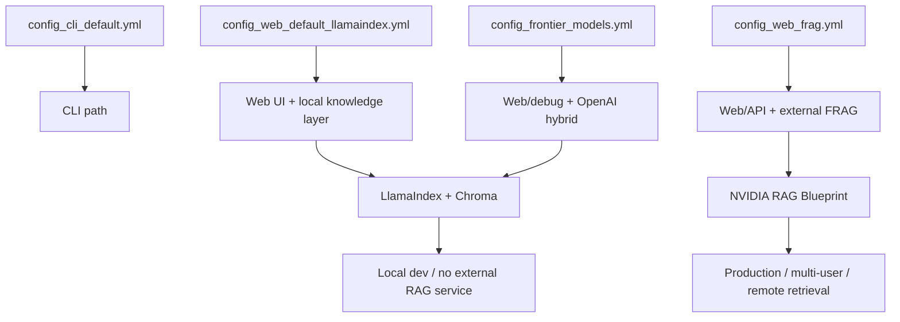
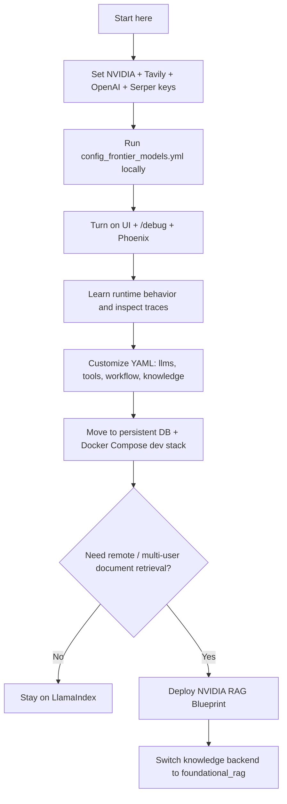

# AI-Q Full Capability Setup and Operations Guide

Verified against this repository and current public docs on 2026-04-05.

This guide is optimized for two goals:

1. Let you run AI-Q at its fullest practical capability.
2. Keep the system inspectable enough that you can later customize the architecture instead of treating it like a black box.

## Short Answers

- **Quickstart** is the minimum working path: local Python env, required keys, and either the CLI or local web UI.
- **Full stack** is not just "required plus optional". It is the operationally complete stack: backend API, async jobs, UI, persistent job state, and containerized services.
- **Docker Compose does not make the agents smarter by itself.** Agent capability comes from config, models, tools, and knowledge backends. Compose mainly improves packaging, persistence, and deployment ergonomics.
- **Maximum visibility** comes from combining:
  - the **web UI**,
  - the **debug console** at `/debug`,
  - **verbose logging**,
  - and a tracing backend like **Phoenix** or **LangSmith**.
- **NVIDIA RAG Blueprint** is the external document ingestion and retrieval stack behind AI-Q's `foundational_rag` backend. Use it when you want production-grade, multi-user document retrieval instead of local LlamaIndex/Chroma.
- **OpenAI works here**, but the shipped OpenAI config is a **hybrid** setup: OpenAI is used for deep orchestration/planning and NVIDIA-hosted models stay on the researcher side unless you customize the YAML.

## 1. External Inputs

### 1A. Third-Party Credentials and Accounts

Use this as the reference table.

| Input | Required? | What it is for | Where to get it | Notes |
|---|---|---|---|---|
| `NVIDIA_API_KEY` | Yes for the shipped configs | Hosted model inference via NVIDIA Build / API Catalog | [NVIDIA Build API Keys](https://build.nvidia.com/settings/api-keys) | This is the core key for the default NVIDIA-hosted LLMs and embedding/VLM defaults. |
| `TAVILY_API_KEY` | Yes for the shipped research configs | Web search | [Tavily Dashboard](https://app.tavily.com) | Without this, the default quickstart research path loses its primary web-search tool. |
| `OPENAI_API_KEY` | Optional, but required if you use `config_frontier_models.yml` or any `_type: openai` LLMs | OpenAI models | [OpenAI API Keys](https://platform.openai.com/api-keys) | The shipped frontier config uses OpenAI for the clarifier and deep orchestrator/planner roles. |
| `SERPER_API_KEY` | Optional | Google Scholar / academic paper search | [Serper](https://serper.dev) | Disabled by default in shipped configs; enable `paper_search_tool` in YAML when you add it. |
| `LANGCHAIN_API_KEY` | Optional | LangSmith tracing, evaluation, run inspection | [LangSmith Settings](https://smith.langchain.com/settings) | Pair with `LANGCHAIN_TRACING_V2=true` and optionally `LANGCHAIN_PROJECT=...`. |
| `WANDB_API_KEY` | Optional | Weights & Biases Weave experiment tracking and traces | [W&B Authorize](https://wandb.ai/authorize) | Only needed if you enable Weave tracing. |
| `JINA_API_KEY` | Optional | Evaluation suite support | [Jina AI](https://jina.ai) | The repo marks this as evaluation-only, not core runtime. |
| `NGC_API_KEY` | Optional | NVIDIA NGC / `nvcr.io` login, some RAG or NIM deployment flows, prebuilt image pulls | [NGC API Keys](https://org.ngc.nvidia.com/setup/api-keys) | This is distinct from `NVIDIA_API_KEY`. You mainly need it for registry access and some NVIDIA deployment workflows. |
| `OAUTH_CLIENT_ID` / `OAUTH_CLIENT_SECRET` / `OAUTH_ISSUER` | Optional | UI login via OIDC/OAuth | Your identity provider's app registration console | Only needed if you turn `REQUIRE_AUTH=true`. AI-Q does not prescribe one auth vendor. |

### 1B. External Endpoints and Infra Values You Provide

These are not "sign up and get a key" inputs. They are endpoints or infra values you decide.

| Input | Required when | What it is for | Typical source |
|---|---|---|---|
| `RAG_SERVER_URL` | Using `backend: foundational_rag` | Query endpoint for NVIDIA RAG Blueprint | Your deployed RAG server, typically port `8081` |
| `RAG_INGEST_URL` | Using `backend: foundational_rag` | Ingestion endpoint for NVIDIA RAG Blueprint | Your deployed ingest server, typically port `8082` |
| `NAT_JOB_STORE_DB_URL` | Recommended for durable web/API/compose use | Async job store + event store DB | SQLite for dev, PostgreSQL for durable deployments |
| `AIQ_CHECKPOINT_DB` | Recommended when you care about workflow persistence | LangGraph checkpoint state | SQLite or PostgreSQL |
| `AIQ_SUMMARY_DB` | If `generate_summary: true` for knowledge layer | Stores document summaries | SQLite or PostgreSQL |
| `BACKEND_URL` | UI and Docker-based UI runs | Where the UI proxies to the backend | Usually `http://localhost:8000` or an internal service URL |
| `NEXTAUTH_SECRET` / `NEXTAUTH_URL` | UI auth enabled | Session and auth runtime config | Your deployment secret / public UI URL |
| `AIQ_EMBED_MODEL` / `AIQ_EMBED_BASE_URL` | If overriding embedding behavior | Embedding model and endpoint for LlamaIndex ingestion | NVIDIA hosted endpoint or your own NIM |
| `AIQ_VLM_MODEL` / `AIQ_VLM_BASE_URL` | If using image/chart extraction | VLM used during document ingestion | NVIDIA hosted endpoint or your own NIM |

### 1C. What Each Credential Actually Enables

- `NVIDIA_API_KEY`
  - Needed for the shipped NVIDIA-hosted LLMs.
  - Also used by the default summary model and the default embedding/VLM stack if you keep LlamaIndex defaults.
- `TAVILY_API_KEY`
  - Enables the primary web-search tool used by shallow and deep research.
- `OPENAI_API_KEY`
  - Enables OpenAI-backed roles if you configure any LLM stanza with `_type: openai`.
  - In the shipped frontier config, OpenAI is used for deep orchestration and planning, not for every role.
- `SERPER_API_KEY`
  - Enables academic paper search through the Google Scholar integration.
- `LANGCHAIN_API_KEY`
  - Gives you a hosted trace UI for runs, prompts, tool calls, timings, and evaluation workflows.
- `WANDB_API_KEY`
  - Enables Weave trace capture and experiment comparison.
- `JINA_API_KEY`
  - Only matters if you turn on the evaluation suite that expects it.
- `NGC_API_KEY`
  - Mostly a deployment/registry credential, not the key you use for the default hosted inference path.

### 1D. Copy-Paste Commands You Actually Need

#### Baseline bootstrap

```bash
cd /path/to/aiq
cp deploy/.env.example deploy/.env
./scripts/setup.sh
source .venv/bin/activate
```

#### Minimal working `.env`

```bash
NVIDIA_API_KEY=...
TAVILY_API_KEY=...
```

#### Strong recommended `.env` for "full capability soon"

```bash
NVIDIA_API_KEY=...
TAVILY_API_KEY=...
OPENAI_API_KEY=...
SERPER_API_KEY=...

# optional visibility
LANGCHAIN_TRACING_V2=true
LANGCHAIN_API_KEY=...
LANGCHAIN_PROJECT=aiq-research

# optional experiment tracking
WANDB_API_KEY=...

# optional Phoenix auth/cloud routing
PHOENIX_API_KEY=...
PHOENIX_COLLECTOR_ENDPOINT=http://127.0.0.1:6006/v1/traces
```

#### Quickstart: interactive CLI

```bash
cd /path/to/aiq
source .venv/bin/activate
./scripts/start_cli.sh
```

#### Quickstart: CLI with maximum terminal verbosity

```bash
cd /path/to/aiq
source .venv/bin/activate
./scripts/start_cli.sh --verbose
```

#### Quickstart: local web UI

```bash
cd /path/to/aiq
source .venv/bin/activate
./scripts/start_e2e.sh --config_file configs/config_web_default_llamaindex.yml
```

#### Recommended "max visibility" local dev run

One-command launcher:

```bash
cd /path/to/aiq
./scripts/start_visibility_stack.sh
```

This starts:

- Phoenix on `http://localhost:6006`
- AI-Q backend on `http://localhost:8000`
- Debug console on `http://localhost:8000/debug`
- Web UI on `http://localhost:3000`

The launcher uses [config_web_visibility_llamaindex.yml](../configs/config_web_visibility_llamaindex.yml).
If you later add a real `OPENAI_API_KEY`, you can switch the launcher to [config_frontier_models_visibility.yml](../configs/config_frontier_models_visibility.yml) with:

```bash
cd /path/to/aiq
./scripts/start_visibility_stack.sh --config_file configs/config_frontier_models_visibility.yml
```

Manual version:

Terminal 1:

```bash
cd /path/to/aiq
source .venv/bin/activate
uv pip install arize-phoenix
python -m phoenix.server.main serve
```

Terminal 2:

```bash
cd /path/to/aiq
source .venv/bin/activate
./scripts/start_server_in_debug_mode.sh --config_file configs/config_frontier_models.yml
```

Terminal 3:

```bash
cd /path/to/aiq/frontends/ui
source /path/to/aiq/.venv/bin/activate
set -a && source /path/to/aiq/deploy/.env && set +a
npm run dev
```

That gives you:

- UI: `http://localhost:3000`
- Backend API: `http://localhost:8000`
- Debug console: `http://localhost:8000/debug`
- Phoenix traces: `http://localhost:6006`

#### Direct one-shot run from the terminal

```bash
cd /path/to/aiq
dotenv -f deploy/.env run .venv/bin/nat run \
  --config_file configs/config_cli_default.yml \
  --input "What is CUDA and how does it relate to GPU programming?"
```

#### Start backend API only

```bash
cd /path/to/aiq
source .venv/bin/activate
dotenv -f deploy/.env run .venv/bin/nat serve \
  --config_file configs/config_web_default_llamaindex.yml
```

#### Submit a direct deep research job

```bash
curl -X POST http://localhost:8000/v1/jobs/async/submit \
  -H "Content-Type: application/json" \
  -d '{"agent_type":"deep_researcher","input":"Compare long-context transformer architectures for inference efficiency"}'
```

#### Stream that job

```bash
curl -N http://localhost:8000/v1/jobs/async/job/<job_id>/stream
```

#### Fetch the final report

```bash
curl http://localhost:8000/v1/jobs/async/job/<job_id>/report
```

#### Full stack with Docker Compose

```bash
cd /path/to/aiq/deploy/compose
docker compose --env-file ../.env -f docker-compose.yaml up -d --build
```

Convenience wrapper from the repo root:

```bash
cd /path/to/aiq
./scripts/start_docker_full_stack.sh --with-phoenix
```

#### Release build with Docker Compose

```bash
cd /path/to/aiq/deploy/compose
BUILD_TARGET=release docker compose --env-file ../.env -f docker-compose.yaml up -d --build
```

#### Important Docker nuance

The **release** image excludes the CLI and debug UI. If you want maximum visibility, prefer local dev mode or a dev-target compose flow while you are learning/customizing.

#### If you want FRAG / NVIDIA RAG Blueprint

Deploy the RAG stack first, then set:

```bash
RAG_SERVER_URL=http://rag-server:8081/v1
RAG_INGEST_URL=http://ingestor-server:8082/v1
```

Then run a FRAG-based config:

```bash
cd /path/to/aiq
source .venv/bin/activate
./scripts/start_e2e.sh --config_file configs/config_web_frag.yml
```

## 2. Built-In Ways to Use This Project

### 2A. Runtime Modes

| Mode | Entry point | What you get | Best for | Tradeoff |
|---|---|---|---|---|
| Interactive CLI | `./scripts/start_cli.sh` | Terminal chat, conversation history, optional verbose traces | Fast iteration, prompt/config testing | Less visual than UI/debug |
| Web UI | `./scripts/start_e2e.sh` | Chat UI, files, reports, citations, thinking panels | Day-to-day use, uploaded docs, richer UX | More moving parts than CLI |
| Server + Debug Console | `./scripts/start_server_in_debug_mode.sh` + UI dev server | API docs, `/debug`, SSE state, subagents, tool calls | Deep inspection and debugging | Split-terminal workflow |
| Raw REST API | `nat serve` + `/v1/jobs/async/*` | Programmatic submit/stream/report control | Integrations, automation, testing | Lower-level than chat UI |
| Docker Compose | `deploy/compose/docker-compose.yaml` | Backend + UI + DB in containers | Durable local stack, deployment parity | Not inherently more inspectable than dev mode |
| Jupyter Notebooks | `docs/notebooks` | Guided walkthroughs and experiments | Learning internals, prototyping | Not the main interactive product path |
| Benchmarks / Evals | `frontends/benchmarks`, `nat eval` | Quantitative evaluation and comparisons | Architecture tuning | Not end-user interaction |

### 2B. Shipped Config Archetypes

| Config | Main purpose | Knowledge backend | Model strategy | Best use |
|---|---|---|---|---|
| `configs/config_cli_default.yml` | Terminal-first quickstart | None by default | NVIDIA-hosted defaults | Fast local CLI use |
| `configs/config_web_default_llamaindex.yml` | Local web/UI default | LlamaIndex + Chroma | NVIDIA-hosted defaults | Best local full-featured dev start |
| `configs/config_web_frag.yml` | External RAG deployment | NVIDIA RAG Blueprint (`foundational_rag`) | NVIDIA-hosted defaults | Production-style remote document retrieval |
| `configs/config_frontier_models.yml` | Hybrid frontier mode | LlamaIndex + Chroma | OpenAI for orchestration/planning, NVIDIA for research roles | Best starting point if you want OpenAI plus inspectable local development |

### 2C. Runtime Flow Diagram



### 2D. Config and Data-Source Diagram



## 3. Recommended Path for You

Your stated goals are:

1. Use the architecture at near-full capability.
2. Understand what is happening.
3. Later customize the architecture safely.

### Recommendation

Use this path:

1. **Start with `config_frontier_models.yml` locally**, not Docker release mode.
2. Add **`NVIDIA_API_KEY` + `TAVILY_API_KEY` + `OPENAI_API_KEY` + `SERPER_API_KEY`**.
3. Run **UI + `/debug` + Phoenix** together.
4. Keep the knowledge backend on **LlamaIndex first**.
5. Only after that, switch to **FRAG / NVIDIA RAG Blueprint** if you need multi-user or remote production retrieval.
6. Once your config stabilizes, move that config into **Docker Compose** with persistent DBs.

### Why this is the right path

- `config_frontier_models.yml` already gives you OpenAI where it matters most in this repo's shipped design: clarifier and deep orchestration/planning.
- LlamaIndex keeps the document stack local and easier to debug.
- The debug console and Phoenix give you much more visibility than a pure Docker release stack.
- YAML remains your primary customization layer, so you can change architecture behavior without immediately editing Python.

### Recommended rollout

#### Phase 1: Learn and inspect

- Use `config_frontier_models.yml`
- Run:
  - UI
  - `/debug`
  - Phoenix
- Enable `SERPER_API_KEY` and uncomment paper search if you want academic coverage

#### Phase 2: Customize in YAML

Start editing these first:

- `llms.*`
- `functions.web_search_tool`
- `functions.knowledge_search`
- `functions.clarifier_agent`
- `functions.shallow_research_agent`
- `functions.deep_research_agent`
- `workflow.*`

Do this before editing Python.

#### Phase 3: Move to durable local full stack

- Add PostgreSQL for `NAT_JOB_STORE_DB_URL`
- Set durable `AIQ_CHECKPOINT_DB`
- Keep using UI + backend + traces

#### Phase 4: Adopt FRAG only if you need it

Switch to `foundational_rag` when:

- you need multi-user document storage,
- remote retrieval services,
- production-style separation of ingestion and query,
- or you want document infrastructure outside the AI-Q process.

### Recommended Path Diagram



## 4. Detailed Answers to Your Questions

### Is "full stack" just required vs required-and-optional?

No.

In this project, **quickstart** means "minimum path to get research working." That usually means:

- local Python environment,
- required keys,
- CLI or local web UI,
- default local storage.

**Full stack** means "operationally complete deployment shape":

- backend API,
- async job runner,
- UI,
- persistent job storage,
- containerized services,
- and optionally an external RAG stack.

So the difference is mostly **topology and operations**, not just "more optional vars".

### What is the NVIDIA RAG Blueprint for?

It is the production-oriented retrieval service that AI-Q talks to when you use the `foundational_rag` backend.

Use it when you want:

- document ingestion handled by a separate service,
- remote retrieval over HTTP,
- a multi-user or production-friendly retrieval layer,
- and a more scalable document stack than local LlamaIndex/Chroma.

Do **not** start there unless you actually need that. For learning and customization, local LlamaIndex is easier.

### I want maximum visibility of the agents, outputs, and model "thinking". What should I use?

Use all of these together:

1. **Web UI**
   - best general operator surface
   - good for report, tasks, citations, and thinking panels
2. **Debug console at `/debug`**
   - best low-level live view of subagents, sources, tool calls, SSE stream, and state
3. **Phoenix or LangSmith**
   - best trace-tree and model/tool timing view
4. **CLI verbose mode**
   - good when you want terminal-only inspection

Important nuance:

- You only see **reasoning/thinking that the model provider actually exposes**.
- AI-Q can surface provider-supplied reasoning metadata and intermediate steps.
- It does **not** magically reveal hidden chain-of-thought from providers that do not expose it.

### Is there a frontend UI that shows this, or only CLI?

Yes, there is a frontend UI.

The visibility surfaces break down like this:

- **Web UI**
  - best end-user interface
  - report, citations, tasks, some thinking
- **Debug console**
  - best engineering/debug interface
  - subagents, sources, tool calls, SSE event stream
- **CLI**
  - fastest terminal workflow
  - verbose mode shows tool calls and thinking events

If your priority is "know what is going on", the best stack is:

- UI
- `/debug`
- Phoenix

### I want to use OpenAI as well. What is the best path?

Use `configs/config_frontier_models.yml` as your starting point.

That config already does something sensible:

- OpenAI for:
  - clarifier
  - deep orchestrator
  - deep planner
- NVIDIA-hosted models for:
  - shallow research
  - deep researcher
  - summary model

That is a strong starting split because it keeps expensive frontier reasoning where it matters most and preserves a strong open/default research worker.

If later you want OpenAI in more roles, edit:

- `functions.shallow_research_agent.llm`
- `functions.deep_research_agent.researcher_llm`
- or add more `llms:` stanzas and rewire role references

### Does Docker Compose give superior agent capability or better visibility?

**Capability:** no, not by itself.

Compose does not upgrade reasoning quality. Quality changes when you change:

- models,
- tools,
- prompts,
- knowledge backend,
- routing behavior,
- and observability/evaluation loops.

**Operational visibility:** somewhat, but indirectly.

Compose gives you:

- a stable backend + UI + DB bundle,
- more durable async job state,
- better deployment parity.

But for raw visibility during development, **local dev mode plus `/debug` plus tracing is better** than a release-style compose stack.

Also note:

- the **release** compose image excludes the CLI and debug UI.

### What does the interactive CLI allow me to do?

The custom CLI is more than a raw `nat run` wrapper.

It gives you:

- interactive terminal chat,
- conversation history behavior,
- automatic orchestrated routing,
- verbose mode for tool calls and thinking,
- fast config testing without spinning up the browser UI.

It is best for:

- trying prompts quickly,
- testing config changes,
- checking whether routing behaves as expected,
- and doing lightweight investigation without the full UI stack.

It is not the best surface for:

- subagent dashboards,
- full research artifact browsing,
- or document-management-heavy workflows.

### What variables should I change first?

If you want maximum leverage, change these before anything else.

#### LLM and provider selection

- `llms.*._type`
- `llms.*.model_name`
- `llms.*.base_url`
- `llms.*.api_key`
- `llms.*.temperature`
- `llms.*.max_tokens`

#### Tool coverage

- `functions.web_search_tool.max_results`
- `functions.web_search_tool.max_content_length`
- `functions.advanced_web_search_tool.advanced_search`
- `functions.paper_search_tool.*`

#### Knowledge layer

- `functions.knowledge_search.backend`
- `functions.knowledge_search.collection_name`
- `functions.knowledge_search.top_k`
- `functions.knowledge_search.generate_summary`
- `functions.knowledge_search.rag_url`
- `functions.knowledge_search.ingest_url`
- `functions.knowledge_search.chroma_dir`

#### Agent behavior

- `functions.clarifier_agent.max_turns`
- `functions.clarifier_agent.enable_plan_approval`
- `functions.shallow_research_agent.max_llm_turns`
- `functions.shallow_research_agent.max_tool_iterations`
- `functions.deep_research_agent.orchestrator_llm`
- `functions.deep_research_agent.researcher_llm`
- `functions.deep_research_agent.planner_llm`
- `functions.deep_research_agent.max_loops`

#### Top-level routing

- `workflow.enable_escalation`
- `workflow.enable_clarifier`
- `workflow.use_async_deep_research`
- `workflow.checkpoint_db`

#### Visibility

- `AIQ_VERBOSE`
- `DEBUG_PROMPTS`
- `LANGCHAIN_TRACING_V2`
- `LANGCHAIN_API_KEY`
- `WANDB_API_KEY`

## Appendix A. Where the Main Agent Infrastructure Lives

If you start editing internals later, begin here:

- `src/aiq_agent/agents/`
- `src/aiq_agent/common/`
- `src/aiq_agent/knowledge/`
- `frontends/aiq_api/src/aiq_api/`
- `frontends/cli/`
- `frontends/ui/`
- `sources/tavily_web_search/`
- `sources/google_scholar_paper_search/`
- `sources/knowledge_layer/`
- `configs/`

Most architecture changes should begin in `configs/` first, then move into `src/aiq_agent/agents/` only when YAML-level customization is no longer enough.

## Appendix B. Files Worth Opening First

- `README.md`
- `deploy/.env.example`
- `configs/config_web_default_llamaindex.yml`
- `configs/config_frontier_models.yml`
- `configs/config_web_frag.yml`
- `docs/source/customization/configuration-reference.md`
- `docs/source/customization/knowledge-layer.md`
- `docs/source/deployment/observability.md`
- `frontends/aiq_api/README.md`
- `src/aiq_agent/agents/chat_researcher/agent.py`
